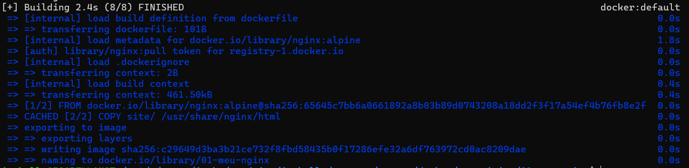
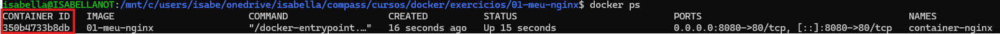

# 🚀 Rodando um container básico com Nginx + Landing Page TailwindCSS

Este Exercício tem como objetivo rodar um container Docker com o servidor Nginx, servindo uma landing page estática baseada em TailwindCSS.

---

## 🧱 Estrutura do projeto

A estrutura do diretório ficou assim:

```
meu-nginx/
├── site/                   # Pasta com os arquivos da landing page
├── dockerfile              # Dockerfile com a imagem do Nginx
└── README.md               # Este arquivo
```

---

## 📥 Clonando uma landing page estática pronta


```bash
git clone https://github.com/tailwindtoolbox/Landing-Page.git site
```
> [!NOTE]\
> Se estiver usando WSL, não se esqueça de acessar o seu diretório pessoal com este comando: 
> `cd /mnt/c/users/seuUsuario`


📌 A pasta deve ser ter essa estrutura ou parecida:

```
site/
├──hero.png
├──index.html
├──LICENSE
└──README.md
```
📌 Após o clone, certifique-se de que a pasta `site/` contenha um arquivo `index.html`.

---

## 🐳 Dockerfile utilizado

```Dockerfile
FROM nginx:alpine
COPY site/ /usr/share/nginx/html
EXPOSE 80
```

---

## 🔨 Build da imagem

Dentro da pasta do projeto:

```bash
docker build -t 01-meu-nginx .
```

> #### Saída esparada pelo WSL:
>

---

## ▶️ Executando o container

```bash
docker run --name container-nginx -p 8080:80 -d meu-nginx
```

> #### No WSL a saída será o ID completo do Container, exemplo:
> 350b4733b8db1056ed1aec67c0c0fd412990f010bfa0e6827e2106b75af6aa62

> [!NOTE]\
> Pode-se verificar o início deste ID com o comando `docker ps`
> 

---

## 🌐 Acessando no navegador

Abra o navegador e vá para:

```
http://localhost:8080
```

---

## ✅ Página correta esperada

Você verá a landing page feita com TailwindCSS.  


---

## 🛠 Tecnologias utilizadas

- [Docker](https://www.docker.com/)
- [Nginx](https://www.nginx.com/)
- [Tailwind Toolbox - Landing Page](https://github.com/tailwindtoolbox/Landing-Page)