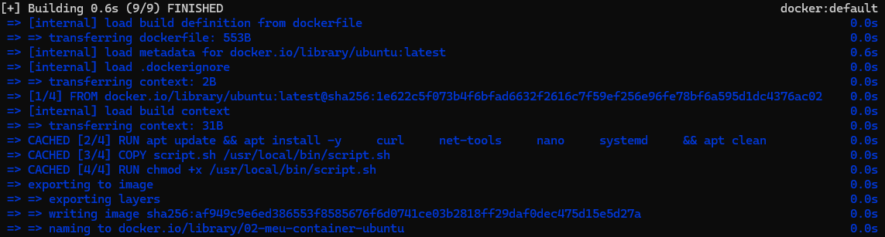
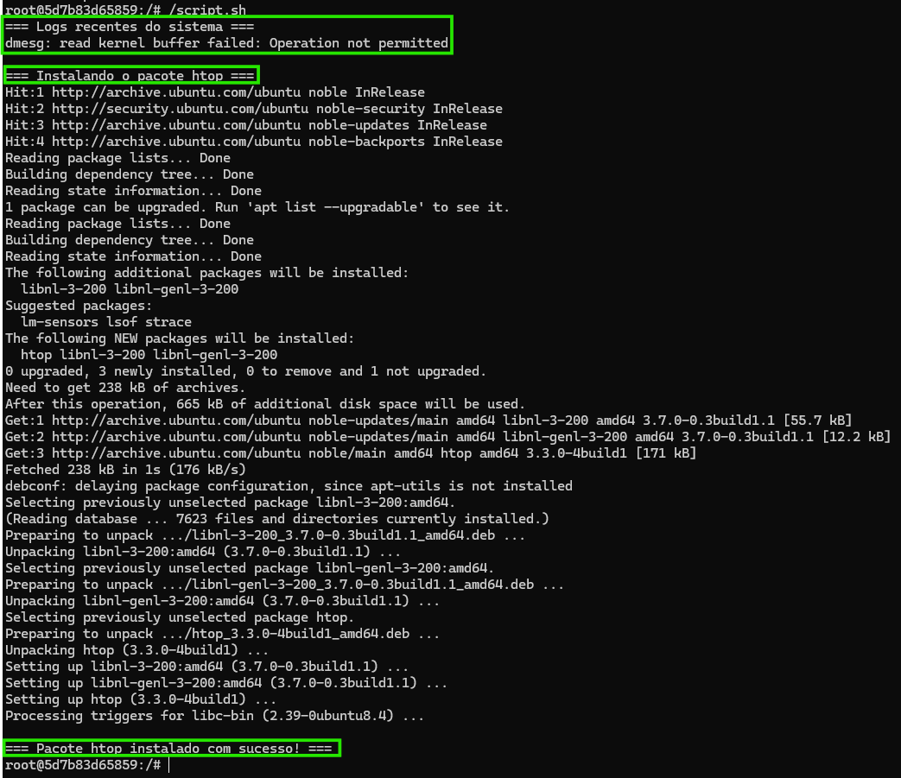
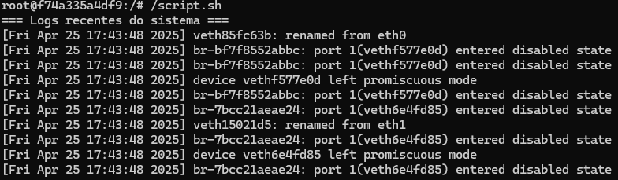

# 🐧 Criando e rodando um container interativo com Ubuntu

Este exercício tem como objetivo criar um container Docker baseado no Ubuntu e interagir com o terminal para executar um script Bash que imprime logs recentes do sistema e instala pacotes de forma interativa.

---

## 🧱 Estrutura do Projeto

A estrutura do diretório está assim:

```
meu-container/
├── dockerfile              # Dockerfile com as instruções para criação da 
├── script.sh               # Script Bash que será executado no container
└── README.md               # Este arquivo
```

---

## 📜 Conteúdo do script.sh

```bash
echo "=== Logs recentes do sistema ==="
dmesg -T | tail -n 10

echo -e "\n=== Instalando o pacote htop ==="
apt update && apt install -y htop

echo -e "\n=== Pacote htop instalado com sucesso! ==="
```

---

## 🐳 Dockerfile utilizado

```Dockerfile
FROM ubuntu:latest

RUN apt update && apt install -y systemd procps

COPY script.sh /script.sh

RUN chmod +x /script.sh

CMD [ "bash" ]

```

> [!NOTE]\ 
>- `RUN apt update && apt install -y systemd procps`: Atualiza o repositório e instala utilitários essenciais
>- `COPY script.sh /script.sh`: Copia o script para o container
>- `RUN chmod +x /script.sh`: Concede permissão de execução
>- `CMD [ "bash" ]`: Define o container para iniciar de forma interativa

---

## 🔨 Build da Imagem

Dentro da pasta do projeto:

```bash
docker build -t 02-meu-container-ubuntu .
```

> #### Saída esparada pelo WSL:
>

> [!NOTE]\ Se estiver usando Rancher Desktop com WSL (Ubuntu), certifique-se de estar no seu diretório correto usando:
> ```bash
> cd /mnt/c/Users/seuUsuario/seuProjeto
> ```

---

## ▶️ Executando o container de forma interativa

```bash
docker run --name container-ubuntu -it meu-container-ubuntu
```

> [!NOTE]\ 
>- `-it`: Permite interação no terminal.
>- `--name`: Dá um nome amigável de sua escolha ao container.

---

## 📂 Executando o script dentro do container

Dentro do terminal interativo do container, execute:

```bash
script.sh
```
> #### Saída esparada pelo WSL:
>

> 📌 O script irá:
> - Mostrar as últimas 10 mensagens do log do sistema (`dmesg`).
> - Atualizar o `apt` e instalar o pacote `htop`.

---

## ⚠️ Sobre o comando dmesg no container

Por padrão, ao executar o script, você poderá ver a seguinte mensagem de erro:

```
dmesg: read kernel buffer failed: Operation not permitted
```

Isso acontece porque containers Docker são isolados do host por motivos de segurança e não podem acessar o buffer de mensagens do kernel.

Se desejar testar o `dmesg` funcionando dentro do container, é possível rodá-lo com privilégios elevados:

```bash
docker run --name container-ubuntu -it --privileged 02-meu-container-ubuntu
```

> #### Saída esperada pelo WSL:
> 

> [!WARNING]\ Utilizar `--privileged` **não é recomendado em produção** pois remove parte do isolamento de segurança do container.

---

## 🛠 Tecnologias utilizadas

- [Docker](https://www.docker.com/)
- [Ubuntu Linux](https://ubuntu.com/)
- [Rancher Desktop](https://rancherdesktop.io/)
- [WSL - Windows Subsystem for Linux](https://learn.microsoft.com/en-us/windows/wsl/)

---
