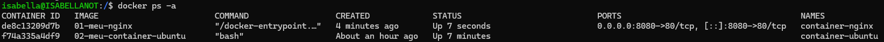
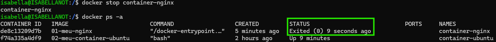
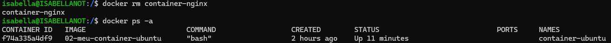
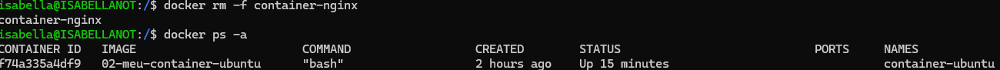

# 🐧 Listando e Removendo Containers

Este exercício tem como objetivo listar todos os containers Docker, parar um container em execução e remover um container específico.

---

## 🧱 Estrutura do Projeto

A estrutura do diretório está assim:

```
meus-containers/
├── README.md               # Este arquivo
```

---

## 📋 Listando Containers

### Containers em Execução

```bash
docker ps
```

> [!NOTE]\ 
> Esse comando lista apenas os containers que estão **em execução**.

### Todos os Containers (em execução e parados)

```bash
docker ps -a
```

> #### Saída esperada pelo WSL:
>  

> [!NOTE]\ 
> O parâmetro `-a` exibe **todos** os containers, inclusive os que estão parados.

---

## ⏹ Parando um Container em Execução

```bash
docker stop <nome_ou_id_do_container>
```

> #### Saída esperada pelo WSL:
> 

> [!TIP]\ 
> Substitua `<nome_ou_id_do_container>` pelo nome ou ID do container listado.

---

## 🗑 Removendo um Container Específico

### Container Parado

```bash
docker rm <nome_ou_id_do_container>
```

> #### Saída esperada pelo WSL:
> 

### Container em Execução (forçando remoção)

```bash
docker rm -f <nome_ou_id_do_container>
```

> #### Saída esperada pelo WSL:
> 

> [!WARNING]\ 
> O parâmetro `-f` **força** a parada e remoção do container. Use com cautela.

---

## 🛠 Tecnologias Utilizadas

- [Docker](https://www.docker.com/)
- [Ubuntu Linux](https://ubuntu.com/)
- [Rancher Desktop](https://rancherdesktop.io/)
- [WSL - Windows Subsystem for Linux](https://learn.microsoft.com/en-us/windows/wsl/)

---