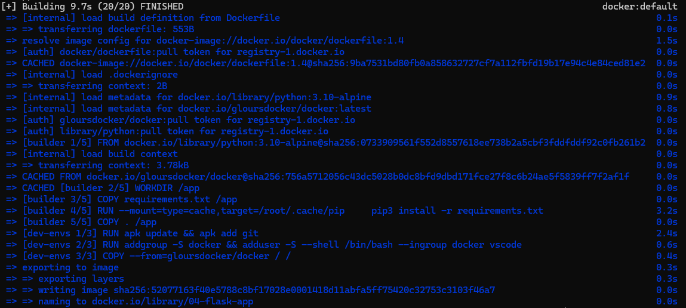

# 🌐 Criando um container Flask com Docker

Este exercício tem como objetivo criar um container Docker com uma aplicação web básica em Flask, utilizando Rancher Desktop e WSL (Ubuntu). A aplicação retorna um simples "Hello World!" ao acessar a URL raiz.

---

## 🧱 Estrutura do Projeto

A estrutura do diretório está assim:

```
meu-app-flask/
├── app.py                 # Código principal da aplicação Flask
├── Dockerfile             # Instruções para criar a imagem Docker
├── requirements.txt       # Dependências do projeto
└── README.md              # Este arquivo
```

---

## 🐍 Conteúdo do app.py

```python
from flask import Flask
app = Flask(__name__)

@app.route('/')
def hello():
    return "Hello World!"

if __name__ == '__main__':
    app.run(host='0.0.0.0', port=8000)
```

> 📌 A aplicação está configurada para escutar em todas as interfaces (`0.0.0.0`) na porta `8000`.

> [!NOTE]> Preferi clonar o repositório `https://github.com/docker/awesome-compose/tree/master/flask` em outra pasta, copiar e colar nesta pasta apenas o arquivo `app.py` para melhor visualização.

---

## 🐳 Dockerfile utilizado

```Dockerfile
FROM python:3.11-slim

WORKDIR /app

COPY requirements.txt requirements.txt

RUN pip install -r requirements.txt

COPY . .

CMD ["python", "app.py"]
```

> [!NOTE]> - `FROM python:3.11-slim`: Utiliza uma imagem Python enxuta e atualizada.  
> - `WORKDIR /app`: Define o diretório de trabalho no container.  
> - `COPY requirements.txt`: Copia as dependências para instalação.  
> - `RUN pip install`: Instala as dependências.  
> - `COPY . .`: Copia todos os arquivos do projeto para dentro do container.  
> - `CMD`: Comando para iniciar a aplicação Flask.

---

## 🔨 Build da Imagem

Dentro da pasta do projeto:

```bash
docker build -t 04-flask-app .
```

> #### Saída esperada pelo WSL:
> 

> [!NOTE]> Se estiver usando Rancher Desktop com WSL (Ubuntu), certifique-se de estar no diretório correto com:
> ```bash
> cd /mnt/c/Users/seuUsuario/seuProjeto
> ```

---

## ▶️ Executando o container

```bash
docker run -d -p 8000:8000 flask-docker-app
```

> #### No WSL a saída será o ID completo do Container, exemplo:
> ba26203a89c20a947b8505dba9b54ac3be43cfa3e4815241efb4206883ba7d4c

> [!NOTE]> - `-d`: Executa o container em segundo plano.  
> - `-p 8000:8000`: Mapeia a porta 8000 do host para a porta 8000 do container.

---

## 🌐 Acessando a aplicação

Abra o navegador e acesse:  
[http://localhost:8000](http://localhost:8000)

> ✅ Você verá a mensagem:  
> `Hello World!`

---

## 🛠 Tecnologias utilizadas

- [Docker](https://www.docker.com/)
- [Python](https://www.python.org/)
- [Flask](https://flask.palletsprojects.com/)
- [Rancher Desktop](https://rancherdesktop.io/)
- [WSL - Windows Subsystem for Linux](https://learn.microsoft.com/en-us/windows/wsl/)
