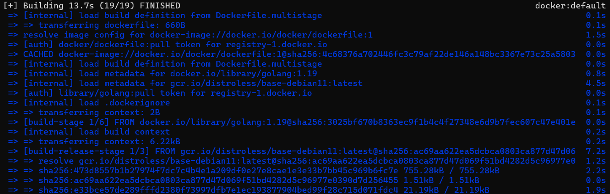

# 🚀 Criando e rodando um container multi-stage com Go

Este exercício tem como objetivo utilizar um **multi-stage build** no Docker para otimizar uma aplicação escrita em **Go**, reduzindo o tamanho da imagem final. O projeto utilizado é o **[docker-gs-ping](https://github.com/docker/docker-gs-ping)**, desenvolvido em Golang.

---

## 🧱 Estrutura do Projeto

A estrutura do diretório está assim:

```
exercicio6/
├── .github/                    # Configurações do GitHub
├── prints/                     # Prints para o readme.md
├── Dockerfile                  # Dockerfile base
├── Dockerfile.multistage       # Dockerfile com multi-stage build
├── go.mod                      # Módulo Go
├── go.sum                      # Dependências
├── LICENSE                     # Licença do projeto
├── main.go                     # Código-fonte principal da aplicação
├── main_test.go                # Testes unitários da aplicação
└── README.md                   # Este arquivo
```

---

## 🔨 Build da Imagem

Dentro da pasta do projeto:

```bash
docker build -f Dockerfile.multistage -t gs-ping-multi-stage .
```

> [!NOTE]\ 
>- `-f Dockerfile.multistage`: Especifica o nome do Dockerfile a ser usado (ao invés do padrão Dockerfile). Isso é útil quando você tem mais de um Dockerfile no projeto.
>- `-t gs-ping-multi-stage`: 	Dá um nome e uma tag à imagem criada. Neste caso, o nome é gs-ping-multi-stage (a tag padrão é latest se não for especificada).

> #### Parte da saída esparada pelo WSL:
> 

> [!NOTE]\ Se estiver usando Rancher Desktop com WSL (Ubuntu), certifique-se de estar no seu diretório correto usando:
> ```bash
> cd /mnt/c/Users/seuUsuario/seuProjeto
> ```

---

## ▶️ Executando o container

```bash
docker run -p 8080:8080 gs-ping-multi-stage
```

> [!NOTE]> O container irá expor um servidor HTTP escutando na porta `8080`.

---

## 🌐 Acessando no navegador

Abra o navegador e vá para:

[http://localhost:8080](http://localhost:8080)

### Resposta esperada:
```
Hello, Docker! <3
```

---

## 🛠 Tecnologias utilizadas

- [Docker](https://www.docker.com/)
- [Ubuntu Linux](https://ubuntu.com/)
- [Rancher Desktop](https://rancherdesktop.io/)
- [WSL - Windows Subsystem for Linux](https://learn.microsoft.com/en-us/windows/wsl/)
- [Go (Golang)](https://golang.org/)
- [Alpine Linux](https://alpinelinux.org/)

---
