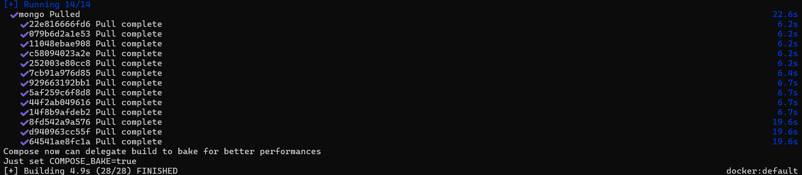
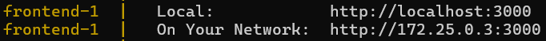
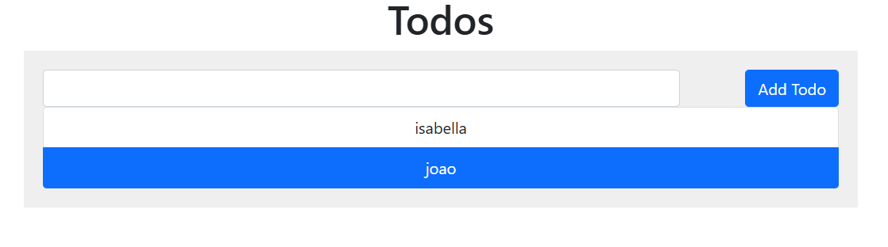

# 🔗 Construindo uma rede Docker para comunicação entre containers

Este exercício tem como objetivo criar uma **rede Docker personalizada** e fazer dois containers — um **Node.js** (Express) e um **MongoDB** — se comunicarem dentro dessa rede. A sugestão é utilizar a stack React + Express + MongoDB como base.

---

## 🧱 Estrutura do Projeto

Este projeto é baseado no repositório [awesome-compose/react-express-mongodb](https://github.com/docker/awesome-compose/tree/master/react-express-mongodb), com as seguintes pastas principais:

```
docker-node-mongo-network/
├── backend/                # Servidor Express (Node.js)
├── frontend/               # Aplicação React
├── mongo/                  # Configuração e volume do banco MongoDB
├── docker-compose.yaml     # Orquestração dos serviços e rede Docker
└── README.md               # Este arquivo
```

---

## 🌐 Sobre a Rede Docker

> ### Única mudança que fiz foi ao final do `compose.yaml`:
> ```
> networks:
>  react-express:
>    driver: bridge
>  express-mongo:
>    driver: bridge
> ```
> Esta mudança serve para adicionar a rede personalida pelo mesmo driver.

Ao utilizar o `docker-compose.yaml`, é criada automaticamente uma **rede personalizada** onde todos os serviços (Node.js, MongoDB e opcionalmente React) podem se comunicar usando seus nomes de serviço como hosts.

---

## 🔨 Build e up dos containers

Dentro da pasta do projeto:

```bash
docker-compose up --build
```

> #### Início da saída esperada pelo WSL:
> 

> Este comando irá:
> - Criar uma rede Docker personalizada
> - Subir os containers do backend (Node.js), MongoDB e frontend (React)

> #### Esta mensagem ao final da saída deste último comando, já comprova que os dois containers estão conectados:
> 

---

## 🧪 Testando a comunicação

Com o ambiente rodando, acesse Abra o navegador e acesse:  
[http://localhost:5000](http://localhost:5000) (backend) ou [http://localhost:8000](http://localhost:8000) (frontend, se ativado).

### Deve aparecer algo assim:
 
---

## 🛠 Tecnologias utilizadas

- [Docker](https://www.docker.com/)
- [Ubuntu Linux](https://ubuntu.com/)
- [Rancher Desktop](https://rancherdesktop.io/)
- [WSL - Windows Subsystem for Linux](https://learn.microsoft.com/en-us/windows/wsl/)
- [Node.js](https://nodejs.org/)
- [Express.js](https://expressjs.com/)
- [MongoDB](https://www.mongodb.com/)

---