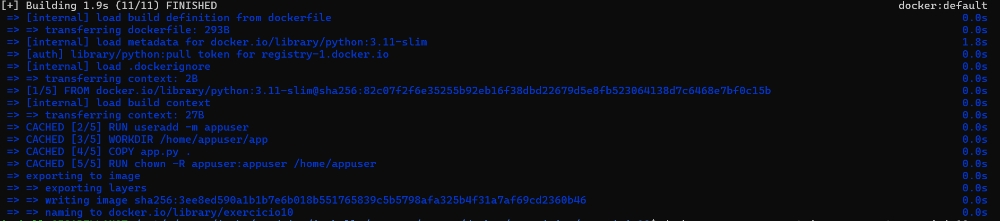
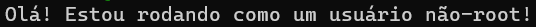

# 🚫 Evitando execução como root em containers Docker

Este exercício tem como objetivo criar um container Docker para uma aplicação simples em Python e configurar o ambiente para que o container **não** rode com o usuário root, aumentando a segurança da aplicação.

---

## 🧱 Estrutura do Projeto

A estrutura do diretório está assim:

```
evitar-execucao-root/
├── dockerfile              # Dockerfile com a criação de usuário não-root
├── app.py                  # Aplicação Python simples
└── README.md               # Este arquivo
```

---

## 📜 Conteúdo do app.py

```python
print("Olá! Estou rodando como um usuário não-root!")
```

---

## 🐳 Dockerfile utilizado

```Dockerfile
FROM python:3.12-slim

RUN addgroup --system appgroup && adduser --system --ingroup appgroup appuser

WORKDIR /home/appuser

COPY app.py .

USER appuser

CMD ["python", "app.py"]
```

> [!NOTE]\ 
> - `addgroup` e `adduser` são usados para criar um grupo e um usuário sem privilégios administrativos.
> - `USER appuser` garante que a aplicação rode com o novo usuário.
> - `CMD ["python", "app.py"]` executa o script Python no container.

---

## 🔨 Build da Imagem

Dentro da pasta do projeto:

```bash
docker build -t exercicio10



> [!NOTE]\ Se estiver usando Rancher Desktop com WSL (Ubuntu), certifique-se de navegar até seu diretório usando:
> ```bash
> cd /mnt/c/Users/seuUsuario/seuProjeto
> ```

---

## ▶️ Executando o container

```bash
docker run --name container-nao-root exercicio10
```

> #### Saída esperada:
>

> [!NOTE]\ 
> - `--name`: Dá um nome amigável ao container para facilitar os testes.

---

## 🔎 Verificando o usuário no container

Para confirmar que o container está rodando como o novo usuário:

```bash
docker exec container-nao-root whoami
```

A saída esperada é:

```
appuser
```

---

## ⚠️ Importância de não rodar como root

Rodar aplicações em containers com usuários não-root é uma boa prática para:
- Minimizar riscos de segurança.
- Reduzir o impacto em caso de comprometimento da aplicação.
- Seguir padrões de segurança recomendados para ambientes em produção.

---

## 🛠 Tecnologias utilizadas

- [Docker](https://www.docker.com/)
- [Python](https://www.python.org/)
- [Rancher Desktop](https://rancherdesktop.io/)
- [WSL - Windows Subsystem for Linux](https://learn.microsoft.com/en-us/windows/wsl/)

---
