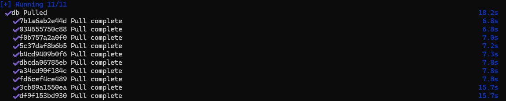
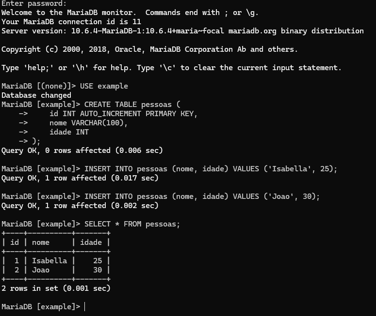
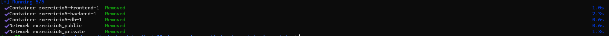
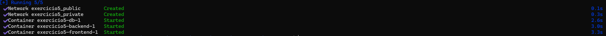
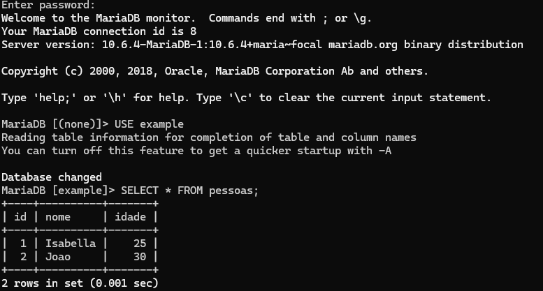

# 🐳 Criando e utilizando volumes para persistência de dados no MySQL

Este exercício tem como objetivo criar um container Docker com o banco de dados **MySQL**, utilizando **volumes** para garantir a **persistência dos dados** mesmo que o container seja removido.

> 📥 Este projeto foi baseado no repositório [docker/awesome-compose - react-express-mysql](https://github.com/docker/awesome-compose/tree/master/react-express-mysql), clonado para utilização.

---

## 🧱 Estrutura do Projeto

A estrutura do diretório está assim:

```
mysql-volume-persistence/
├── compose.yaml          # Arquivo para orquestração do container MySQL
├── backend/
├── db/
├── frontend/
└── README.md             # Este arquivo
```

---

## 🔨 Subindo o ambiente

Dentro da pasta do projeto clonado:

```bash
docker compose up -d
```

> #### Início da saída esperada:
>

> [!NOTE]\ 
>- `-d`: Rodar o comando em background.

> [!NOTE]\ Se estiver usando Rancher Desktop com WSL (Ubuntu), certifique-se de estar no seu diretório correto usando:
> ```bash
> cd /mnt/c/Users/seuUsuario/seuProjeto
> ```

---

## 🔍 Verificando os volumes

Liste os volumes criados:

```bash
docker volume ls
```

Você verá algo como:

```
DRIVER    VOLUME NAME
local     exercicio5_db-data
```

---

## ▶️ Acessando o banco de dados

Para acessar o MySQL rodando no container:

```bash
docker exec -it exercicio5-db-1 mysql -u exampleuser -p
```

Senha: `db-btf5q`

> [!NOTE]\ 
> - O `exampleuser` foi a única modificação que fiz no compose.yaml, onde retirei o usuário root.
> - A senha pode ser encontrada dentro da pasta db, no arquivo `password.txt`.

---

## 📂 Persistência de dados

Teste a persistência:

1. **Crie uma tabela** e insira alguns dados no banco.


2. **Derrube o container**:

```bash
docker compose down
```


3. **Suba o container novamente**:

```bash
docker compose up -d
```


4. **Verifique que os dados continuam lá**!
 
---

## 🛠 Tecnologias utilizadas

- [Docker](https://www.docker.com/)
- [MySQL](https://www.mysql.com/)
- [Rancher Desktop](https://rancherdesktop.io/)
- [WSL - Windows Subsystem for Linux](https://learn.microsoft.com/en-us/windows/wsl/)