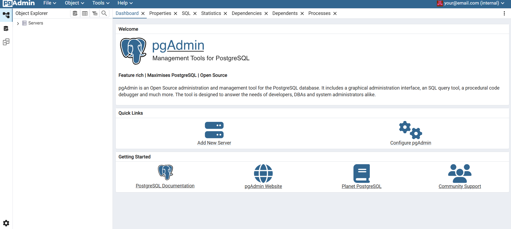

# 🐟 Criando um Compose File para rodar PostgreSQL e PgAdmin

Este exercício tem como objetivo criar um ambiente Docker Compose com um banco de dados PostgreSQL e o gerenciador PgAdmin para administração do banco de dados.

---

## 🧱 Estrutura do Projeto

A estrutura do diretório está assim:

```
postgresql-pgadmin/
├── docker-compose.yml     # Arquivo de configuração do Docker Compose
├── .env                   # Arquivo com variáveis de ambiente
├── README.md              # Este arquivo
```

---

## 📜 Conteúdo do docker-compose.yml

```yaml
version: '3.8'
services:
  db:
    image: postgres:13
    environment:
      POSTGRES_USER: ${POSTGRES_USER}
      POSTGRES_PASSWORD: ${POSTGRES_PW}
      POSTGRES_DB: ${POSTGRES_DB}
    volumes:
      - db-data:/var/lib/postgresql/data
    ports:
      - "5432:5432"

  pgadmin:
    image: dpage/pgadmin4
    environment:
      PGADMIN_DEFAULT_EMAIL: ${PGADMIN_MAIL}
      PGADMIN_DEFAULT_PASSWORD: ${PGADMIN_PW}
    ports:
      - "5050:80"
    depends_on:
      - db

volumes:
  db-data:
```

> [!NOTE]\
> - As variáveis são carregadas do arquivo `.env`
> - `db`: Serviço do banco de dados PostgreSQL.
> - `pgadmin`: Interface web para gerenciar o banco de dados.
> - `volumes`: Volume persistente para os dados do PostgreSQL.

---

## 🛠️ Variáveis de Ambiente (.env)

Modifique o arquivo `.env` com o seguinte conteúdo:

```env
POSTGRES_USER=yourUser
POSTGRES_PW=changeit
POSTGRES_DB=postgres
PGADMIN_MAIL=admin@admin.com
PGADMIN_PW=admin
```

---

## 🔨 Subindo os containers

Dentro da pasta do projeto:

```bash
docker-compose up -d
```

> [!NOTE]\
> - `up -d`: Inicializa os serviços em segundo plano (modo "detached").

---

## 🌐 Acessando o PgAdmin

Após subir os containers, abra seu navegador e acesse:

```
http://localhost:5050
```

Use as credenciais configuradas:
- **Email**: admin@admin.com
- **Senha**: admin

> #### Você deve ver esta tela:
>  

---

## 💪 Tecnologias utilizadas

- [Docker](https://www.docker.com/)
- [Docker Compose](https://docs.docker.com/compose/)
- [PostgreSQL](https://www.postgresql.org/)
- [PgAdmin 4](https://www.pgadmin.org/)

---

> 📍 Baseado no repositório [docker/awesome-compose - postgresql-pgadmin](https://github.com/docker/awesome-compose/tree/master/postgresql-pgadmin)
